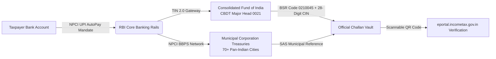

# KarSetu (करसेतु) — India''s 1-Click Sovereign Tax Autopilot

[](https://react.dev/)
[](https://www.typescriptlang.org/)
[](https://tailwindcss.com/)
[](https://vitejs.dev/)
[](https://athuls-engineer.github.io/karsetu-tax-autopay/)
[](https://opensource.org/licenses/MIT)

> 🌐 **Live Website**: **[https://athuls-engineer.github.io/karsetu-tax-autopay/](https://athuls-engineer.github.io/karsetu-tax-autopay/)**
>
> **KarSetu (करसेतु)** is a non-custodial, institutional tax orchestration platform engineered to automate Advance Tax installments, Municipal Property Taxes, Capital Gains liabilities, and GST/TDS settlements in India with **zero intermediary wallet float**, full RBI e-Mandate compliance, and instant cryptographic verification.

---

## 🏛️ System Architecture & Money Trail

KarSetu operates on a **zero-escrow, non-custodial sovereign model** under Article 266(1) of the Constitution of India. Funds **never** touch a private wallet, pool account, or intermediary fintech server.



---

## ✨ Key Capabilities

### 1. 4-Stage Sovereign Clearance Pipeline
* Simulates the exact multi-tier clearing handshake:
  1. **Mandate & Cap Validation**: Enforces user-configured debit caps (e.g. ₹1,00,000 max) under RBI regulations.
  2. **Core Banking Direct Sweep**: Debits directly from primary linked bank account (HDFC, SBI, ICICI, etc.).
  3. **Consolidated Fund Credit**: Direct transfer to sovereign treasury nodes without middleman float.
  4. **Cryptographic Challan Generation**: Issues authentic Challan 280 / GST PMT-06 / BBPS SAS receipts with verified 7-digit BSR codes and 28-digit CINs mirrored to Form 26AS.

### 2. Camera-Scannable QR & Government Verification Engine
* Real-time high-density QR code generation using `qrcode` matrix rendering.
* Point any smartphone camera at the screen to read and open the official CBDT verification URL:
  `https://eportal.incometax.gov.in/iec/foservices/#/pre-login/verify-challan?cin=...`
* Includes 1-click government portal redirect, clipboard CIN copying, and live TIN 2.0 HTTPS handshake simulator.

### 3. Pan-Indian Municipal Property Tax Hub (70+ Cities via BBPS)
* Full support across all 5 Indian regions:
  * **South**: Bengaluru (BBMP), Chennai (GCC), Hyderabad (GHMC), Mysuru (MCC), Coimbatore (CCMC), Kochi, Thiruvananthapuram, Visakhapatnam, Vijayawada.
  * **West**: Mumbai (MCGM / BMC), Pune (PMC), Ahmedabad (AMC), Surat (SMC), Navi Mumbai (NMMC), Thane (TMC), Nagpur, Nashik, Vadodara, Panaji (CCP).
  * **North**: Delhi (MCD), New Delhi (NDMC), Gurugram (MCG), Lucknow (LMC), Kanpur (KNN), Jaipur, Chandigarh (MCC), Ludhiana, Varanasi.
  * **East & Central**: Kolkata (KMC), Howrah (HMC), Patna (PMC), Bhubaneswar (BMC), Guwahati (GMC), Indore (IMC), Bhopal (BMC), Raipur (RMC).
* Automatic capture of **5% to 10% early-bird filing rebates** with editable Property Assessment IDs (SAS PID).

### 4. UPI AutoPay Hub & RBI Account Aggregator (AA) Rails
* Comprehensive support for **20+ Indian banks** (HDFC, SBI, ICICI, Axis, Kotak, PNB, BOB, Canara, IndusInd, Federal, Union, IDFC FIRST, Yes Bank, etc.).
* Automated bank detection and IFSC resolution from UPI handles (`@okhdfcbank`, `@oksbi`, `@axl`, etc.).
* Simulated encrypted Account Aggregator balance lookup with privacy toggle (`●●●●●●` vs `₹84,250`).

### 5. Budget 2024-25 Tax Slabs & Regime Battleground
* Dynamic side-by-side computation of New vs. Old Tax Regimes factoring:
  * Section 87A rebate (zero tax up to ₹7.75L in New Regime).
  * Standard deduction ₹75,000.
  * Budget 2024 Capital Gains rates: 20% STCG and 12.5% LTCG above ₹1.25L exemption.
  * Section 234C installment schedule (15%, 45%, 75%, 100%) preventing 1% compound monthly penalties.

### 6. Fraud Defense Shield & Non-Custodial Architecture
* **Nodal Payee Lock**: Sweeps are physically hardcoded to CBDT & CBIC nodal accounts. No third-party UPI addresses can receive funds.
* **72-Hour Pre-Notice Guarantee**: WhatsApp & SMS alerts with 1-tap cancellation before any debit occurs (RBI Circular 2023).
* **Interactive Fraud Intercept Simulator**: Tests and visualizes real-time interception of spoofed payee payloads.

### 7. Multilingual & Dual Executive Theme
* Fully localized across **9 Indian languages**: English, Hindi (हिन्दी), Tamil (தமிழ்), Telugu (తెలుగు), Kannada (ಕನ್ನಡ), Malayalam (മലയാളം), Marathi (मराठी), Bengali (বাংলা), and Gujarati (ગુજરાતી).
* **High-Contrast Light Mode**: Clean, executive slate-and-white theme with zero pitch-dark muddy blocks.
* **Pure AMOLED Dark Mode**: True `#000000` / `#0A0A0A` black backgrounds with glowing neon indicators.

---

## 🛠️ Tech Stack

* **Frontend**: React 19, TypeScript
* **Styling**: Tailwind CSS, Material 3 Expressive Design tokens
* **Icons**: Lucide React
* **QR Engine**: `qrcode` (SVG / Canvas matrix generator)
* **Effects**: Canvas Confetti
* **Tooling**: Vite 6, PostCSS, Autoprefixer

---

## 🚀 Getting Started

### Prerequisites
* Node.js (v18.0 or higher)
* npm or pnpm

### Installation

```bash
# Clone the repository
git clone https://github.com/athuls-engineer/karsetu-tax-autopay.git

# Navigate to the project directory
cd karsetu-tax-autopay

# Install dependencies
npm install

# Start the local development server
npm run dev
```

Open [http://localhost:5173](http://localhost:5173) in your browser to launch the application.

### Production Build

```bash
# Typecheck and compile production bundle
npm run build

# Preview production build locally
npm run preview
```

---

## 📜 Regulatory & Legal Compliance

* **RBI e-Mandate Circular (2023)**: Mandatory pre-debit notifications, explicit recurring caps, and 1-tap revocation.
* **CBDT TIN 2.0 Specifications**: Electronic challan generation with 7-digit BSR code and 28-digit CIN.
* **NPCI BBPS Guidelines**: Standardized biller resolution and municipal tax settlements.
* **Digital Personal Data Protection (DPDP) Act 2023**: Non-custodial credential handling; zero storage of MPINs, passwords, or CVVs.

---

## 📄 License

This project is licensed under the **MIT License** — see the [LICENSE](LICENSE) file for details.

Copyright (c) 2026 Athul S.
